# Stellar ZK-RWA Bridge: Technical Flow

## System Architecture

The following sequence diagram illustrates the lifecycle of a private Real World Asset (RWA) transaction on the Stellar ZK-RWA Bridge.

### Core Workflow

1.  **Compliance Check (Off-Chain)**: The user provides private data (e.g., passport info, accreditation status) to the SP1 ZK Prover.
2.  **Proof Generation**: The SP1 Prover runs the compliance logic inside a ZKVM and generates a ZK proof. No private data leaves this step; only the proof.
3.  **On-Chain Verification**: The user submits the ZK Proof to the Soroban Contract.
4.  **Asset Action**: If the proof is valid, the contract executes the privileged action (e.g., minting tokens) to the user's wallet.

```mermaid
sequenceDiagram
    autonumber
    participant User as 👤 User (Client)
    participant Prover as ⚙️ SP1 ZK Prover (Off-Chain)
    participant Contract as 📄 Soroban Contract (On-Chain)
    participant Ledger as 📒 Stellar Ledger

    Note over User, Prover: Phase 1: Zero-Knowledge Proof Generation
    User->>Prover: Submit Private Input (Identity/Assets)
    Prover->>Prover: Execute Compliance Logic (ZKVM)
    Prover->>Prover: Generate SP1 ZK Proof
    Prover-->>User: Return Proof + Public Values

    Note over User, Contract: Phase 2: On-Chain Verification & Settlement
    User->>Contract: invoke verify_and_mint(Proof, PublicValues)
    Contract->>Contract: Verify SP1 Proof (Groth16/Plonk)
    
    alt Proof is Valid
        Contract->>Ledger: Mint RWA Tokens to User
        Ledger-->>User: Update Balance
    else Proof is Invalid
        Contract-->>User: Revert Transaction
    end
```

## Component Roles

### 1. User Client
- Holds the private data.
- Initiates the interaction.
- Pays gas fees for the Soroban transaction.

### 2. SP1 Prover (Off-Chain)
- **Technology**: Succinct SP1 (Rust-based ZKVM).
- **Role**: Proves that the user satisfies complex Rust-based compliance rules without revealing the input data.
- **Output**: A small, verifiable proof.

### 3. Soroban Contract (On-Chain)
- **Technology**: Rust / Soroban SDK.
- **Role**: Acts as the Verifier. It holds the "Verification Key" for the compliance program.
- **Security**: Trustless. It relies entirely on the cryptographic validity of the submitted proof.

## Key Data Structures

### Proof Payload
The `proof` submitted to the contract typically contains:
- **Proof Bytes**: The cryptographic evidence.
- **Public Inputs**: Data revealed to the chain (e.g., "User is accredited", "Country is US"), but *not* raw private data (like SSN).
