# Stellar ZK-RWA Bridge: Technical Flow

## System Architecture

The following sequence diagram illustrates the lifecycle of a private Real World Asset (RWA) transaction on the Stellar ZK-RWA Bridge.

### Core Workflow

1.  **Compliance Check (Off-Chain)**: The user provides private data to the SP1 ZK Prover.
2.  **Proof Generation**: The SP1 Prover generates a ZK proof asserting compliance.
3.  **Gateway Certification**: A trusted off-chain "Gateway" verifies the ZK proof and **signs** the result with its private Ed25519 key.
4.  **On-Chain Settlement**: The user submits the *Gateway's Signature* to the Soroban Contract. The contract verifies the signature (cheap) instead of the ZK proof (expensive).

```mermaid
sequenceDiagram
    autonumber
    participant User as 👤 User (Client)
    participant Prover as ⚙️ SP1 Prover
    participant Gateway as 🏛️ Gateway Authority
    participant Contract as 📄 Soroban Contract
    participant Ledger as 📒 Ledger

    Note over User, Gateway: Phase 1: Off-Chain Privacy & Certification
    User->>Prover: Submit Private Input
    Prover->>Prover: Generate ZK Proof
    Prover->>Gateway: Submit Proof for Signing
    Gateway->>Gateway: Verify ZK Proof (Off-Chain)
    Gateway-->>User: Return Signed Payload (Ed25519)

    Note over User, Contract: Phase 2: On-Chain Settlement
    User->>Contract: verify_and_mint(Payload, Signature)
    Contract->>Contract: Validate Gateway Signature
    
    alt Signature is Valid
        Contract->>Ledger: Mint RWA Tokens
        Ledger-->>User: Update Balance
    else Signature Invalid
        Contract-->>User: Revert
    end
```

## Component Roles

### 1. User Client
- Initiates the flow.
- Holds private data.

### 2. SP1 Prover & Gateway (Off-Chain)
- **Prover**: Generates the heavy Zero-Knowledge Proof.
- **Gateway**: Trusted entity that verifies the proof off-chain and signs the result.
- **Why?**: Verifying a ZK proof on Stellar costs >100M CPU instructions. Checking a signature costs <0.5M. This "Optimistic" pattern enables privacy on mainnet today.

### 3. Soroban Contract (On-Chain)
- **Role**: Verifies the *Gateway's Signature*.
- **Security**: Relies on the Gateway's honesty (Authorization/Authority model) rather than direct cryptographic verification of the proof on-chain.

## Key Data Structures

### Signed Payload
The contract verifies a signature over:
- `User Address`: Who is compliant?
- `Token ID`: What asset are they allowed to mint?
- `Expiry`: Timestamp to prevent replay attacks.
